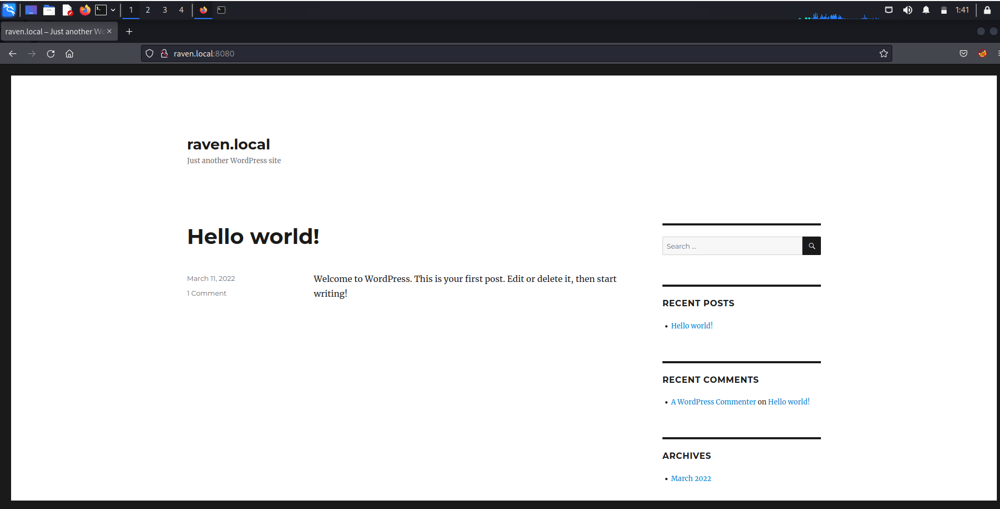
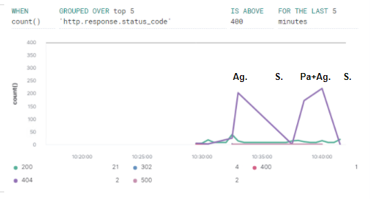
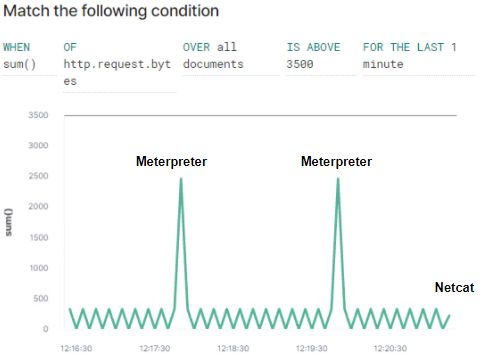
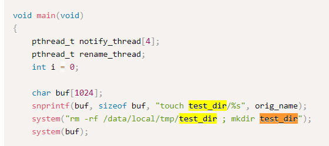
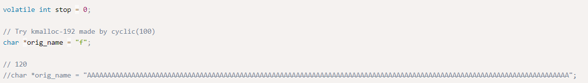
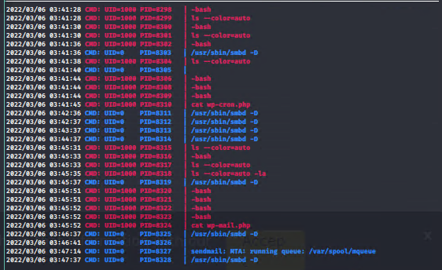
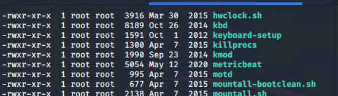
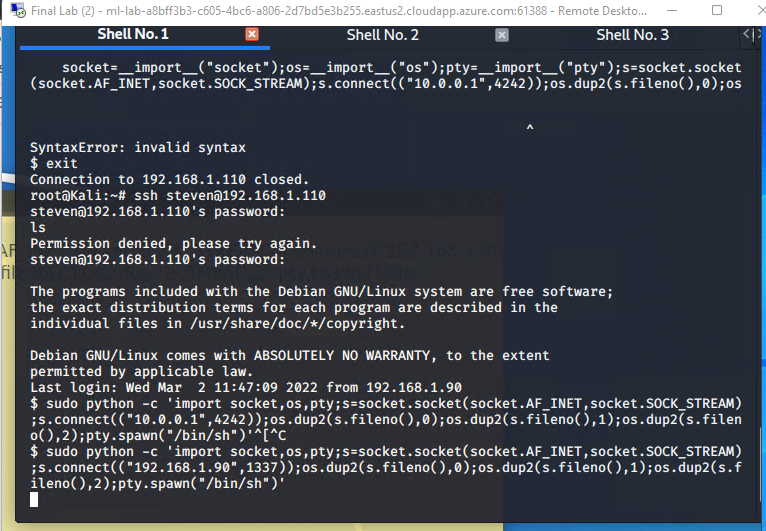
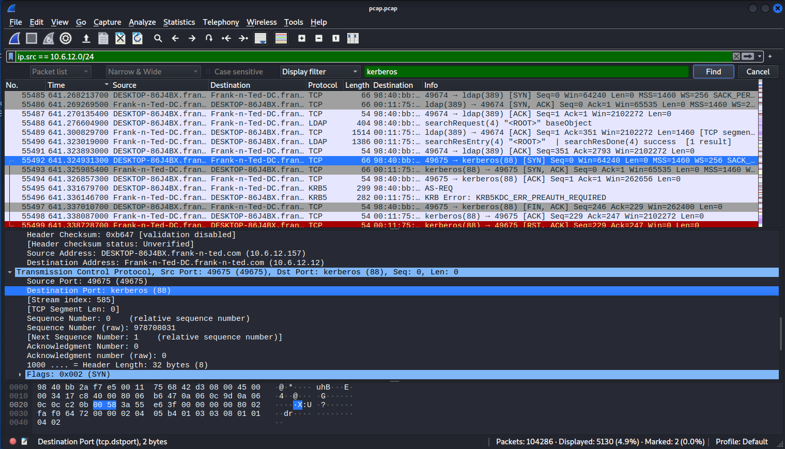
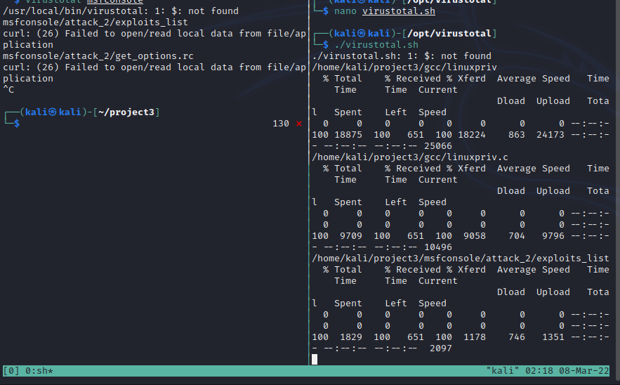

# Scoping Wordpress Target 1 


------------------

-------------------------

# Blue Team: Summary of Operations

## Table of Contents
- Network Topology
- Description of Targets
- Monitoring the Targets
- Patterns of Traffic & Behavior
- Suggestions for Going Further

### Network Topology
=======

The following machines were identified on the network:
- Name of VM 1
  - **Operating System**: Linux
  - **Purpose**: Wordpress Server
  - **IP Address**: 192.168.1.110
- Name of VM 2
  - **Operating System**: Kali
  - **Purpose**: Attacker Machine
  - **IP Address**: 192.168.1.90

### Description of Targets

The target of this attack was: 192.168.1.110.

Target 1 is an Apache web server and has SSH enabled, so ports 80 and 22 are possible ports of entry for attackers. As such, the following alerts have been implemented:

### Monitoring the Targets

Traffic to these services should be carefully monitored. To this end, we have implemented the alerts below:

#### Excessive HTTP Errors

Alert 1 is implemented as follows:
  - **Metric**: Packetbeat
  - **Threshold**: Grouped over 5 and above 400 for the last 5 minutes
  - **Vulnerability Mitigated**:  BruteForce 
  - **Reliability**:  Medium-High Reliability. Alert catches enumeration,  but not stealth or throttling.

#### CPU Usage Monitor
Alert 2 is implemented as follows:
  - **Metric**: Metricbeat
  - **Threshold**: When max() OF system.process.cpu.total.pct Overa all documents IS ABOVE -.5 FOR THE LAST 5 minutes
  - **Vulnerability Mitigated**: Local Enumeration
  - **Reliability**:  Reliable as it is based upon the baseline of CPU usage for the internal . High reliability of target 1

#### HTTP Request Size Monitor
Alert 3 is implemented as follows:
  - **Metric**: Metricbeat
  - **Threshold**: WHEN sum() OF http.request.bytes OVER all documents IS ABOVE 3500 FOR THE LAST 1 minute 
  - **Vulnerability Mitigated**: Collective byte for documents. Exploits and Enumeration. 
  - **Reliability**: Threshold is too high to catch meterpreter shells. Low reliability as the threshold was set too high.

---------------------------------

# Red Team: Summary of Operations

## Table of Contents
- Scoping Web Machine.
- Exposed Services.
- Critical Vulnerabilities.
- Exploitation.

### Scoping Web Machine

##### Virtualization of wordpress installed by docker:



##### Wpscan 
	wpscan --url http://192.168.1.110


### Exposed Services

Nmap scan results for each machine reveal the below services and OS details:

```bash
$ nmap ...
nmap -sC -sV -A -p- 192.168.1.110
```

This scan identifies the services below as potential points of entry:
- Target 1
  - List of
  - Exposed Services

		- 22 : OpenSSH 6.7p1 Debian 5+deb8u4 protocol 2.0
			- ssh -hostkey 
		- 80 : Apache httpd 2.4.10 (Debian)
		- 111: rpcbind 2-4 
		- 139: netbios-ssn Samba smbd 3.x -4.X (workgroup: WORKGROUP)
		- 445 netbios-ssn samba smbd 4.2.14-Debian (Workgroup: WORKGROUP)
		- Linux 3.x|4.x 

The following vulnerabilities were identified on each target:
- Target 1
wpscan results; 

	wordpress version 4.8.18
	
	
	
### Exploitation

The Red Team was able to penetrate `Target 1` and retrieve the following confidential data:
- Target 1
  - `flag1.txt`: 
    - **Exploit Used**
      - Exposed wordpress pages:
			  - service.html
			  - wp-config.php
  - `flag2.txt`:
    - **Exploit Used**
		  - Weak SSH Cipher 
		  - Rainbow Tables

### Aggressive, Passive vs Stealth Modes

    
	CWE's: 
		- CWE-548: Exposure of Information Through Directory Listing
		- CWE-672: Operation on a Resource after Expiration of Release

 - `flag3.txt`: 
  - `flag4.txt`:
    - **Exploit Used**
			- mysql -u root -p; 
			- mysql database password in wp-config.php
	CWE's:
    	- CWE-521: Weak Password Requirements
		- CWE-522: Insufficiently Protected Credentials 
	
  - `flag5.txt`:
    - **Exploit Used**
			- Sudo -l 
			- sudo python -c 'import pty;pty.spawn("/bin/bash")'

### Meterpreter Stageless Shell vs Netcat Connection Shell


		CWE's:
			- CWE-250: Execution with Unnecessary Privileges 
			
			
### Vulnerable to CVE-2017-7533
# Linux Kernel < 3.16.39 (Debian 8 x64) - 'inotfiy' Local Privilege Escalation

Buffer Overflow Attack where "test_dir" is created with full permissions in the current directory without sudo priviledges. This is an older exploit for older linux systems. 

*from exploit db [Linux Kernel < 3.16.39 (Debian 8 x64) - 'inotfiy' Local Privilege Escalation - Linux_x86-64 local Exploit (exploit-db.com)](https://www.exploit-db.com/exploits/44302)*



Where a fully +777 file can be created with a file inside containing code to execute. 



file "F" is created within a directory with priviledges above normal without sudo. 

###### pyspy root crontabs  


The inotify attack can be used to grant permissions to write in cron and logrotations. 




##### Sendmail 


Email sending the php script that encodes a reverse shell and unpacks php. 


 ---------------------------------------------------
 


# Network Forensic Analysis Report

At least two users on the network have been wasting time on YouTube. Usually, IT wouldn't pay much mind to this behavior, but it seems these people have created their own web server on the corporate network. So far, Security knows the following about these time thieves:

-   They have set up an Active Directory network.
-   They are constantly watching videos on YouTube.
-   Their IP addresses are somewhere in the range `10.6.12.0/24`.

## Time Thieves 

1. Custom Domain alias: 
		- Frank-n-Ted.com
2.  IP address of the Domain Controller (DC) of the AD network
		- 10.6.12.12	


3.  Name of the malware downloaded to the 10.6.12.203 machine:
		-June11.dll
		
#### Upload a Directory of Files  to [VirusTotal.com](https://www.virustotal.com/gui/) Utilizing Virustotal API in Bash. 

. 
7. Malware Classification:
		- Trojan Horse 

---

## Vulnerable Windows Machine

1. Infected Windows Machine:
    - Host name ROTTERDAM-PC
    - IP address 172.16.4.205
    - MAC address 00:59:07:b0:63:a4
    
2. Username of infected Windows user: -> Matthijs.devries
3. IP addresses used in infection traffic -> 182.243.115.84
4. Desktop Background of host: **empty.gif**

---

## Illegal Downloads

1. Machine and Ip Address`10.0.0.201`:
    - MAC address 00:16:17:18:66:c8
    - Windows username: username-blanco 
    - OS version: **Mozilla/5.0 (Windows NT 10.0; Win64; x64) AppleWebKit/537.36 (KHTML, like Gecko) Chrome/64.0.3282.140 Safari/537.36 Edge/17.17134**

2. Torrent File Downloaded:
		- Betty Boop Rhythm on the Reservation.avi.torrent


